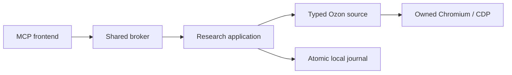

# Configuration and behavior

[Русский обзор](../README.md) · [English overview](../README.en.md) · [Contracts](../contracts/README.md)

This describes Ozon MCP 3.0.0 and public `schemaVersion: "3"`. [Historical v2 behavior and validation](validation/v2-history.md) is preserved separately.

## Module ownership

`src/main.rs` exposes MCP discovery and forwards validated calls. `src/runtime/` owns the broker, launch configuration, bounded transport and Chromium/CDP lifecycle. `src/ozon/` owns source routes, privacy projection and typed decoding. `src/research/` owns tool execution, observation normalization, continuation and the atomic journal. `src/contracts.rs` composes the checked-in public schemas; `src/images.rs` owns safe raster retrieval. Browser extraction is authored in `browser/extract.ts` and embedded from its generated JavaScript.



## Process and configuration

Each MCP client starts a stdio frontend. Private local IPC connects frontends to one broker, one persistent Chromium profile, and one observed account/region context. The broker owns Chromium directly through a narrow CDP connection. It resolves configuration once and rejects incompatible frontend/broker configurations. It does not install or invoke `agent-browser`, use its daemon, or create fallback profiles.

| Variable | Default | Meaning |
|---|---|---|
| `OZON_DATA_DIR` | macOS: `$HOME/Library/Application Support/ozon-mcp-server`; Linux: `$XDG_DATA_HOME/ozon-mcp-server`, or `$HOME/.local/share/ozon-mcp-server` | Private state, `broker.sock`, and `journal.sqlite3`. |
| `OZON_USER_DATA_DIR` | `OZON_DATA_DIR/browser-profile` | The single persistent browser profile. |
| `OZON_BROWSER_EXECUTABLE` | Unset | Explicit absolute executable path to installed native Chrome/Chromium; required when a live operation launches the browser. |
| `OZON_HEADLESS` | `true` | Exactly `true` or `false`; other values fail configuration. |
| `OZON_IMAGE_DOH_FALLBACK` | `off` | Exactly `on` or `off`; narrowly scoped image DNS fallback. |

Data and profile paths are absolute and private, owned by the current OS user with mode `0700`. Unsafe symlinks are rejected. The fixed socket path must fit within 103 encoded bytes; choose a shorter private data directory if necessary. macOS and Linux are supported; Windows is unsupported. Frontend and explicit `--broker` launches resolve the same defaults.

Default browser execution is headless, without a visible window or focus capture. Visible mode is only for explicitly requested manual setup. Set `OZON_HEADLESS=false` before broker startup, request context, then sign in or select the region manually. Stop the broker gracefully (Ctrl+C for foreground `--broker`, or SIGTERM) before returning to headless mode with the same profile. A running broker retains its launch configuration and stops after ten idle minutes. There is no automatic login, region change, TLS-verification bypass, user-agent camouflage, or alternate profile.

The profile may contain cookies. Keep it and the data directory outside the repository. Journal observations exclude credentials, cookies, account identifiers, full addresses, raw DOM/widgets, and unrestricted stderr. Retired socket, driver, hide-window, and MCP text-mode configuration options are not compatibility paths.

## Context and support

`ozon_get_context` separates observed access, account state, and region from static capabilities (`supported` or `unsupported`). Capabilities do not assert current source health or previous probe success. Seller offers are unsupported and cannot be requested as a product section. Each operation reports its actual status independently.

Region observation accepts only supported public city signals. An anonymous header may expose a city. An authenticated header may instead contain delivery timing or an address, which must not be misread as a city. Where the exact supported same-origin address-book link is observed, the source reads only the city prefix of the single selected address, keeps full addresses inside the browser, restores the home page, and confirms consistent context. Ambiguous or missing signals remain unverified. No address is selected or saved by the server.

The context is observable rather than an account identity guarantee. Two accounts in the same city may expose indistinguishable signals. An observed city is not a delivery guarantee. Live reads check context before and after retrieval; changed or unconfirmed context cannot produce a committed successful observation.

## Responses and continuation

All eight tools use one lean response in MCP `structuredContent`. Text points to the structured result; image tools append image content with explicit content indices. Text-only compatibility is not supported. Successes carry `schemaVersion: "3"`. Whole-tool failures carry typed errors and omit success `structuredContent`; batch results preserve selector order and may contain successful siblings beside per-item failures.

The top-level `evidence` array is empty. Row `evidenceRefs` resolve locally through `ozon_get_research`, `section: evidence`. Candidate snapshots are immutable historical observations, retrievable with `section: candidates` and selected `productRefs`. Neither journal reads nor evidence expansion refresh a price or stock observation.

Products default to `include: ["characteristics"]`. Explicit sections are `characteristics`, `description`, `variants`, and `images`. Each of 1–8 product selectors contains exactly one `productRef`, `sku`, `url`, or `cursor`. A section cursor retains its section; continuation omits `include`. Search and review facets are opt-in with `includeFacets: true`. Search refinement pages default to 12 entries, allow at most 100, and are bounded to 8,000 UTF-16 units per cached page.

References bind to research and captured context. A product reference stores SKU identity; an absent optional URL does not invalidate that SKU. Variants emitted by the server are valid references within that research. Navigation cursors expire after 30 minutes and retain their query, filters, and selection criteria. Context changes invalidate live continuation. A listing continuation restores its saved query and omits a new `query`. Local continuation reads the retained snapshot at its original timestamp. Captured search-page remainders are consumed before fetching the next observed source page.

Source ordering, labels, observation time, and provenance are preserved. Missing or malformed source sections remain unknown or partial; they do not establish an empty list. Local size caps shorten only at whole-item boundaries and report continuation or incomplete coverage. A confirmed end is required for `hasNext: false`. Source truncation and local paging are distinct.

Prices are integer minor units. `ozon_card` is a separate observed payment condition; neither visibility nor another price proves eligibility. An unknown delivery fee or customs charge is not zero. Product prices, delivery labels, and duty do not establish a checkout total. A search price range uses the source's refinement with an unknown price basis. Inspect `priceRangeAssessment` and each row's `matchesDisplayedPriceRange`; out-of-range rows stay in source order, with warnings.

Short characteristics remain partial unless a complete supported source is observed. Missing or whitespace-only descriptions are unknown. Source titles and attribute labels are preserved rather than rewritten from agent guesses. Variants use observed SKU mappings. Review aggregate scope is retained. Stable review IDs are deduplicated; anonymous reviews remain distinct. Cursor replay does not grow cumulative coverage. Coverage is bounded to 30,000 identities per chain; repeated source pages without progress stop with a typed failure rather than claiming an end.

## Atomic journal

The v3 journal is `journal.sqlite3`, with schema `user_version = 1`. The former `research.sqlite3`, old markers, profiles, and artifacts are not automatically migrated or deleted. v2 references and cursors do not become v3 authority. See [ADR 0001](adr/0001-v3-contract-and-journal.md).

One accepted operation atomically commits its references, evidence, cursors, and event after public schema, response-budget, context, and cancellation validation. A failed validation or journal write cannot expose a partially committed observation. Reference validity comes from stored reference records rather than event arrays. A successful marketplace result requires its journal commit to succeed.

Search events retain the query wording, price criteria and selected refinement descriptor. Expiry of navigation references does not erase that history. Admission renews only the active research lease; retention and capacity eviction run within accepted journal operations.

`ozon_get_research` defaults to `summary`. Events, notes, and evidence are paged with record and byte budgets; continuation reflects the records actually returned. Exact selections do not accept paging fields. Research listing uses keyset continuation. Summaries are bounded and do not promise to contain every reference.

Retention is 30 days with a 512 MiB budget for retained live SQLite pages. WAL, checkpoints, and compaction may require transient additional filesystem space; there is no strict instantaneous database-plus-WAL filesystem cap. Active research receives a lease before asynchronous work and at least ten minutes of idle protection. Maintenance removes eligible research as a whole. Protected data can cause writes to fail with `STORAGE_FULL`.

`ozon_append_research_note` validates references in the same research and is idempotent by `(researchId, operationId)`. Canonically identical content returns the previous result; changed reuse returns `CONFLICT`. Notes are agent judgments, distinct from marketplace observations. Source text and notes are untrusted data, never instructions.

## Images and DNS

Images require stored research-bound references. Downloads accept HTTPS `ir.ozone.ru`, validate redirects and public destination addresses, pin the destination, verify TLS, validate raster MIME, and decode within resource budgets. Limits include one MiB per returned image, four MiB per call, and a 20-megapixel decoded source. Each successful image has a hash and MCP content index; a failed sibling does not hide successful images.

System DNS remains primary. With `OZON_IMAGE_DOH_FALLBACK=on`, fallback is permitted only when every system answer is in synthetic `198.18.0.0/15`. It queries the constant CDN hostname through Google Public DNS over HTTPS using a validated public bootstrap destination. DNS questions, CNAME chains, and final addresses are checked; other private or mixed answers remain rejected. Product URLs, queries, account data, and cookies are not sent to the resolver; EDNS client subnet is disabled. No operating-system DNS or VPN configuration is changed. With the default `off`, synthetic DNS answers fail safely.

## Ownership, cancellation, and recovery

One admission/source lease covers the complete operation: context acquisition, reads, confirmation, journal commit, and cleanup. Cancellation does not release ownership while work or cleanup is still running. Structured JSON and the complete envelope are bounded; resource failures stay typed rather than silently dropping requested meaning.

The broker closes the browser it owns and confirms cleanup. Recovery uses recorded browser/profile identity and fails closed when ownership cannot be established. A surviving non-child browser on macOS is closed only through its exact recorded browser WebSocket/CDP identity; a guessed PID is never authority to kill a process. Unconfirmed cleanup preserves the ownership boundary. Profile data and research history are not recovery debris.

Keep the MCP profile exclusive to its broker; do not launch another Chromium with that directory concurrently. Native Singleton entries cause launch refusal before a new process starts and remain untouched. Stale native entries require manual resolution; there is no automatic takeover of an external browser. The metadata check cannot coordinate an independently launched Chromium that ignores the broker's profile lease.

## Verification

See [v3 local acceptance, 2026-09-30](validation/v3-2026-09-30.md) for measured stage times, monitored headless execution and actual MCP stdio acceptance.

Run `python scripts/check.py` in an environment containing pinned `jsonschema[format]` 4.25.1. The entry point runs the same sequential stages locally and in CI: Rust formatting, TypeScript compilation/generated freshness, Node VM tests, independent schema validation, Rust tests, and strict Clippy. `--offline` uses cached dependencies; `--artifacts DIRECTORY` selects readable logs and `results.json` with actual timings. The normal gate does not launch a browser, services, or a VM, and does not contact Ozon.

`browser/extract.ts` generates tracked `browser/extract.js`; runtime builds do not require npm when that generated file is current. Real Chromium lifecycle acceptance uses a disposable explicit profile and is separate from the deterministic gate. Live Ozon checks and target-client discovery/transport acceptance are additional layers. Passing one layer does not establish the others, account identity, catalog recall, or recommendation quality. [Archived v2 results](validation/v2-history.md) retain their original scope and dates and are not v3 acceptance evidence.

### Optional live smoke

The live smoke uses an explicitly selected binary and browser, two MCP frontends, and its own broker with a fresh private disposable profile. It reads Ozon and retains its profile and artifacts. It does not reuse the normal user profile. Choose a new output directory for every run:

```sh
uv run --no-project --with 'jsonschema[format]==4.25.1' --with 'pillow==12.3.0' python scripts/live-smoke.py \
  --binary /absolute/path/target/debug/ozon-mcp-server \
  --browser-executable '/Applications/Google Chrome.app/Contents/MacOS/Google Chrome' \
  --output-dir /absolute/path/new-live-artifacts
```

On Linux, substitute the absolute Chromium executable path. `--data-dir` optionally selects a new private directory; otherwise the script creates a short fresh temporary root. `--query` can be repeated. `--crash-restart` exercises recovery after terminating only the script-owned broker. `--total-timeout` defaults to 600 seconds. The script enforces headless mode and disables DoH fallback. Live-only Pillow independently checks returned images; production image handling uses Rust codecs.

The smoke covers all eight tools, schema-validated calls, cross-client continuation, product/review images, journal reads, note idempotency, and reconnect. Exit status is 0 for PASS, 2 for PARTIAL when required source observations are unavailable, and 1 for FAIL. A command example is not an executed acceptance result. Real-window visibility and focus behavior require separately recorded lifecycle evidence; the headless configuration requirement alone does not prove their observation on a particular host.
